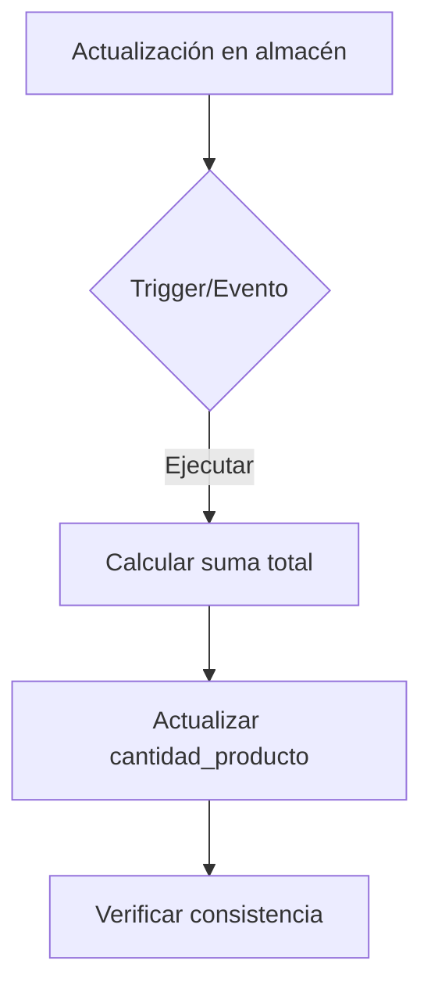

**Implementación de Stock Total Automatizado** 🔄📦

Para implementar la **cantidad_producto como suma del stock total** de manera profesional y segura, te propongo esta solución estratégica:



### **Paso 1: Modificación del Modelo Producto** 💻
```php
// En Producto.php
protected $appends = ['stock_total'];

// Eliminar el campo cantidad_producto del $fillable
protected $fillable = [
    ... // Quitar 'cantidad_producto' de la lista
];

// Nuevo accesor calculado
public function getStockTotalAttribute()
{
    return $this->almacenes->sum('pivot.cantidad');
}

// Observer para sincronización automática
public static function boot()
{
    parent::boot();

    static::updating(function ($producto) {
        if ($producto->isDirty('stock_total')) {
            throw new \Exception('Actualización manual no permitida');
        }
    });
}
```

### **Paso 2: Crear Migración de Actualización** 📦
```php
// En migración
Schema::table('productos', function (Blueprint $table) {
    $table->dropColumn('cantidad_producto'); // Eliminar columna redundante
});

// Crear tabla de historial de stock
Schema::create('stock_historial', function (Blueprint $table) {
    $table->id();
    $table->foreignId('producto_id')->constrained();
    $table->foreignId('almacen_id')->constrained();
    $table->integer('cantidad_anterior');
    $table->integer('diferencia');
    $table->timestamp('fecha_cambio');
    $table->foreignId('user_id')->constrained();
});
```

### **Paso 3: Configurar Eventos en AlmacenProducto** 🔄
```php
// Crear observer para la tabla pivote
class AlmacenProductoObserver
{
    public function updated($pivot)
    {
        HistorialStock::create([
            'producto_id' => $pivot->producto_id,
            'almacen_id' => $pivot->almacen_id,
            'cantidad_anterior' => $pivot->getOriginal('cantidad'),
            'diferencia' => $pivot->cantidad - $pivot->getOriginal('cantidad'),
            'user_id' => auth()->id()
        ]);
    }
}
```

### **Ventajas Clave** ✅
1. **Consistencia Garantizada**:  
   - Elimina duplicación de datos  
   - Cálculos en tiempo real  
   - Historial auditado de cambios  

2. **Optimización de Rendimiento**:  
   ```php
   // Ejemplo de consulta optimizada
   Producto::withSum('almacenes as stock_total', 'almacen_producto.cantidad')
       ->when($request->stock_min, fn($q) => $q->having('stock_total', '>=', $request->stock_min))
       ->get();
   ```

3. **Seguridad Transaccional**:  
   ```php
   DB::transaction(function () use ($almacen, $producto, $cantidad) {
       $almacen->productos()->updateExistingPivot($producto->id, [
           'cantidad' => DB::raw("cantidad + $cantidad")
       ]);
       
       // Auditoría automática vía observer
   });
   ```

### **Flujo de Trabajo Optimizado** 🚀
```mermaid
sequenceDiagram
    Participante Usuario
    Participante Sistema
    Participante BaseDatos
    
    Usuario->>Sistema: Actualiza stock en almacén
    Sistema->>BaseDatos: Transacción BEGIN
    BaseDatos->>BaseDatos: Lock registro pivote
    Sistema->>BaseDatos: Update almacen_producto
    Sistema->>BaseDatos: Insert historial_stock
    BaseDatos->>Sistema: COMMIT
    Sistema->>Usuario: Confirmación de actualización
```

### **Recomendaciones Adicionales** 💡
1. **Índices para Optimización**:  
   ```php
   // En migración
   $table->index(['producto_id', 'almacen_id'], 'almacen_producto_index');
   ```

2. **Sistema de Caché**:  
   ```php
   // Cachear stock total por 15 minutos
   $stock = Cache::remember("producto_{$id}_stock", 900, function () use ($id) {
       return Producto::find($id)->almacenes->sum('pivot.cantidad');
   });
   ```

3. **Endpoints API**:  
   ```php
   // Route para obtener stock
   Route::get('/productos/{id}/stock', function ($id) {
       return response()->json([
           'stock_total' => Producto::findOrFail($id)->stock_total,
           'detalle_almacenes' => Producto::with('almacenes:id,nombre_almacen')->find($id)
       ]);
   });
   ```

**¿Por qué esta solución es superior?** 🔥  
- Elimina redundancia de datos  
- Mantiene integridad transaccional  
- Proporciona trazabilidad completa  
- Escala perfectamente para múltiples almacenes  
- Reduce errores humanos en actualizaciones manuales  

¿Necesitas ayuda para implementar algún componente específico o ajustar la configuración? 😊
